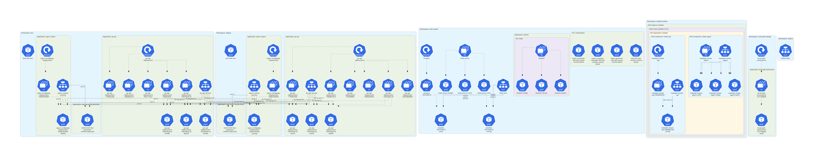

Welcome!, This readme was made for to track the problems I faced in the Lab. The lab is being made to resemble a production setup as closely as possible, but they're still things it falls short on. Hence, some of these problems will be induced to mimic events in prod setups.

## 1. Workload in Control Plane
The lab uses KIND(Kubernetes in Docker) to deploy k8s, and by default in a standard enviroment (contol plane and worker nodes), a taint is applied on the control plane to prevent workloads without the required tolerance from being deployed there (in cloud setups it's the same). However, since i only had one node and that was the control-plane this taint wasn't applied and workloads were being deployed into it.

### Solution
To solve this I made a config.yaml with a control plane and worker nodes. The old plane was deleted and this config.yaml deployed. The taint for the control-plane was then able to take effect and all workloads were deployed to the worker nodes.

## 2. Too many Logs to monitor
As the pod count kept on increasing, so had the difficulty when monitoring the logs in real time.

### Solution 
I found a tool called kubetail that allows uses a web dashboard to to display all the logs in my cluster in real-time. I can filter logs by time, pod, namespace and node. And i can also switch between local and remote clusters making it ideal for porduction. I gave a breakdown on this here https://x.com/DanielMakhoba_E/status/1929112097272557761

## 3. Nginx path hit and miss
When experimenting with sidecar containers (web server(nginx) + logger) and a seperate nginx-deployment. The the sidecar contianer port had a different path "/app.log" and the deployments path had a "/" and "/custom" path. When performing curls to the service, it would sometime show the result and, sometimes a forbidden or not found error.

### Solution
This highlighted how the service object works. It is not aware of which pods have a particular path rather it merely checks if they'ready and sends traffic , which can result in a miss or a hit. To solve i would use an ingress controller to enable path absed routing

## 4. Maintaining architecture
As the Lab grows, the number of elements (Clusters, namespaces, replicasets, pods etc.) keep increasing, making it harder to keep track of the architecture, and wastes time trying to develop it.

### Solution
I found a tool called KubeDiagrams which solves this by using the manifests,helm, and kubectl to determine the state of the environment. KubeDiagrams can also be integrated into CI/CD pipelines and is suitable

## 5. Termination Period taking too long
One of my pods was taking too long to terminate, although it eventually did, the possibility that it wouldn't always terminate on-time still existed

### solution 
To prevent this i added a termination grace period cluster-wide on all deployments

## 6. Stateful Postgres Error - Residual data from PVC
I made an error with an init container in the pod. It was writing a txt file to the path of the volumeMount. The pod went into a crashBackLoop. 

### Solution
I didn't realize that postgres runs an initDB on that path to check if it's empty. I fixed that by deleting the init container, but I was still getting the same error. I realized that the pvc (with the edited path) used was still available and the pod was connecting to it. I deleted the old pvc and re-ran the manifest, which successfully provisioned the pod