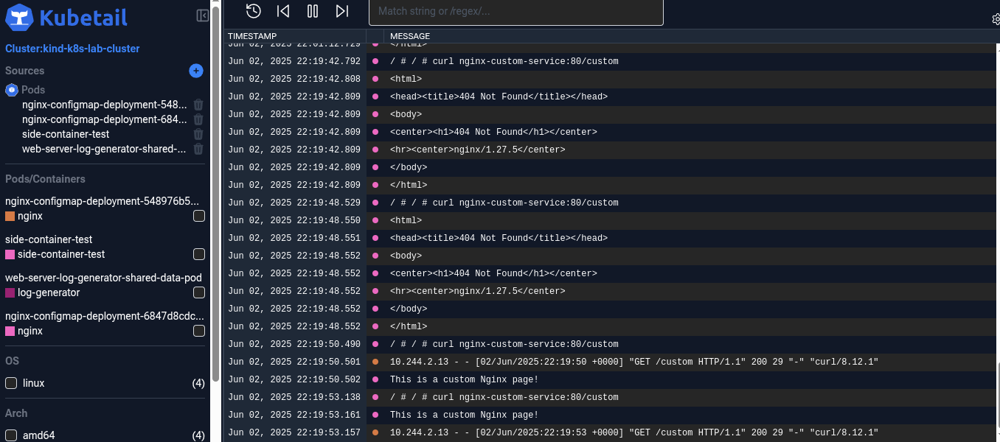
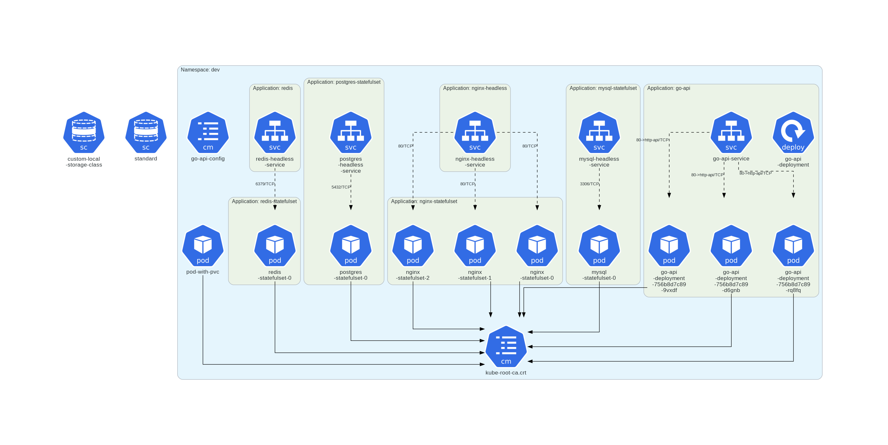

## 1. Workload in Control Plane
The lab uses KIND(Kubernetes in Docker) to deploy k8s, and by default in a standard enviroment (contol plane and worker nodes), a taint is applied on the control plane to prevent workloads without the required tolerance from being deployed there (in cloud setups it's the same). However, since i only had one node and that was the control-plane this taint wasn't applied and workloads were being deployed into it.

### Solution
To solve this I made a config.yaml with a control plane and worker nodes. The old plane was deleted and this config.yaml deployed. The taint for the control-plane was then able to take effect and all workloads were deployed to the worker nodes.

## 2. Too many Logs to monitor
As the pod count kept on increasing, so had the difficulty when monitoring the logs in real time.

### Solution 
I found a tool called kubetail that allows uses a web dashboard to to display all the logs in my cluster in real-time. I can filter logs by time, pod, namespace and node. And i can also switch between local and remote clusters making it ideal for porduction. I gave a breakdown on this here https://x.com/DanielMakhoba_E/status/1929112097272557761

## 3. Nginx path hit and miss
When experimenting with sidecar containers (web server(nginx) + logger) and a seperate nginx-deployment. The the sidecar contianer port had a different path "/app.log" and the deployments path had a "/" and "/custom" path. When performing curls to the service, it would sometime show the result and, sometimes a forbidden or not found error.

### Solution
This highlighted how the service object works. It is not aware of which pods have a particular path rather it merely checks if they'ready and sends traffic , which can result in a miss or a hit. To solve i would use an ingress controller to enable path absed routing

## 4. Maintaining architecture
As the Lab grows, the number of elements (Clusters, namespaces, replicasets, pods etc.) keep increasing, making it harder to keep track of the architecture, and wastes time trying to develop it.

### Solution
I found a tool called KubeDiagrams which solves this by using the manifests,helm, and kubectl to determine the state of the environment. KubeDiagrams can also be integrated into CI/CD pipelines and is suitable

## 5. Termination Period taking too long
One of my pods was taking too long to terminate, although it eventually did, the possibility that it wouldn't always terminate on-time still existed

### solution 
To prevent this i added a termination grace period cluster-wide on all deployments

## 6. Stateful Postgres Error - Residual data from PVC
I made an error with an init container in the pod. It was writing a txt file to the path of the volumeMount. The pod went into a crashBackLoop. 

### Solution
I didn't realize that postgres runs an initDB on that path to check if it's empty. I fixed that by deleting the init container, but I was still getting the same error. I realized that the pvc (with the edited path) used was still available and the pod was connecting to it. I deleted the old pvc and re-ran the manifest, which successfully provisioned the pod.

## 7. Staging Environment Pods connecting to wrong Database
The pods in the staging environment were using the dev environments postgresql instance instead of their envionment's. This misconfiguration didn't lead to any problems, but was found when i was auiting the yaml files and noticed it.

### Solution
For the Go API pods to connect to the postgresql databases , the FQDN for the service has to be used. This FQDN `postgres-headless-service.dev.svc.cluster.local` was specified in the `go-api-credentials` yaml initially. The issue however was there are two environments. Meaning if this yaml was applied as well in the staging environment it would point to the dev environments POstgres instance, ignoring its own. 

To fix this I seperated the go-api-credentials yaml into two `go-api-credentials-dev` and `go-api-credentials-staging`

## 8. CoreDNS Caused a Cluster-wide Failure
The Go API Pods across the cluster were stuck in a CrashBackLoop cycle. While some might occasionally connect briefly, the majority consistently failed to establish a database connection. At the same time my ISP eas experiencing a major downtime in my region.

### Solution
My initial troubleshooting involved deleting the Go API deployment and re-deploying it using a different ISP. This, however, led to the same issue, ruling out the external network as the sole cause. The Go API pod logs, while initially confusing, consistently showed a `failed to connect to postgres-headless-service.dev.svc.cluster.local` error, specifically indicating a problem resolving the database service's IP address. This was strange, since the PostgreSQL database pod and its headless service were working fine.

I decided to test the connectivity from within the cluster using a busybox pod. Running `nc -vz postgres-headless-service.dev.svc.cluster.local 5432` from the busybox pod. This returned a "bad address" error. This confirmed that DNS resolution for the database service was failing from inside the cluster, indicating CoreDNS as the potential issue.

After inspecting the CoreDNS pods in the kube-system namespace, they initially appeared Running. However, diving deeper into their logs revealed critical errors: CoreDNS was repeatedly failing to connect to the Kubernetes API server (the kubernetes service at 10.96.0.1:443) with "dial tcp i/o timeout" messages. This meant CoreDNS was "blind" to the cluster's services and endpoints, hence unable to resolve service names.

This pointed to a fundamental, cluster-wide network breakdown, likely stemming from a corrupted state in Kind's underlying Docker network bridge hightened by the recent external network issues. Given the severity of the problem, a full cluster reset was done. After a clean recreation of the Kind cluster and redeploying my applications, all core components became stable, and the Go API pods successfully connected to the PostgreSQL database

## 9. Pipeline keeps building on every commit (the irony!)
Everytime I made a commit regardless of if it affected the the dockerfiles or backend code, or not the pipeline would run.

## Solution
This was due to my faulty design of the pipeline. I fixed the pipeline to only run when the code involving the deployed services were changed