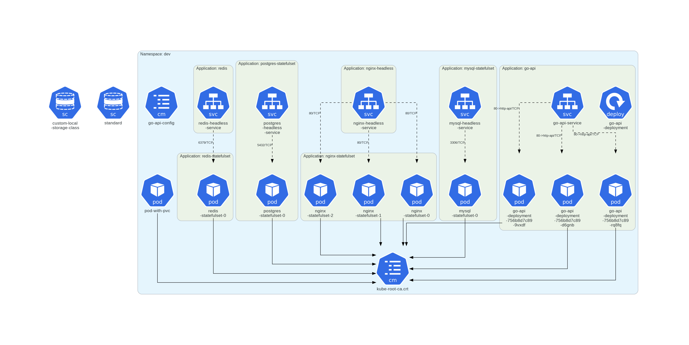
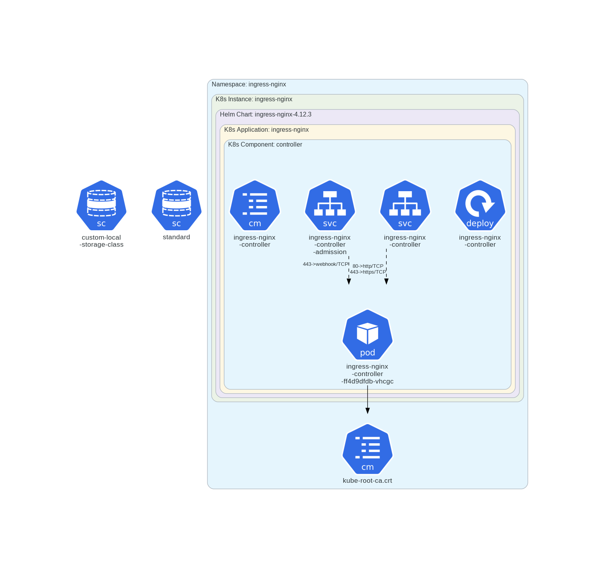
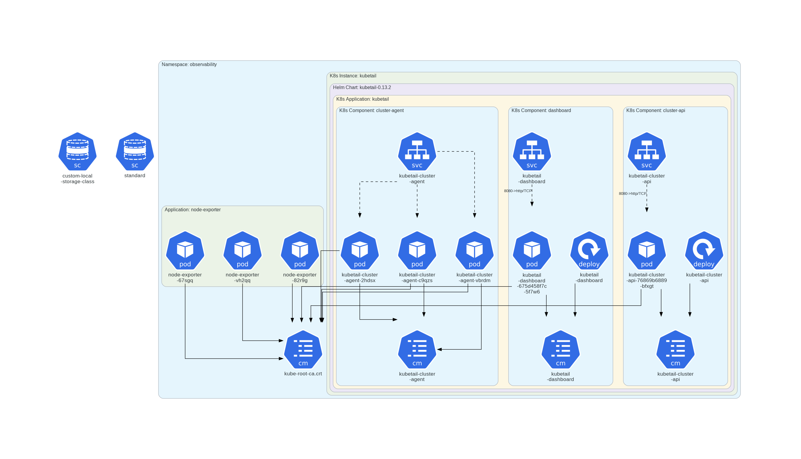

# Architectures

My architecture diagrams are automated using an opensource tool called kube-Diagrams. Kube-Diagrams allows to really specify what i want in the diagram and generates it. You can checkout their official repo on GitHub.

## Development(Dev) Namespace

## Ingress(Nginx) Namespace

## Observability Namespace
