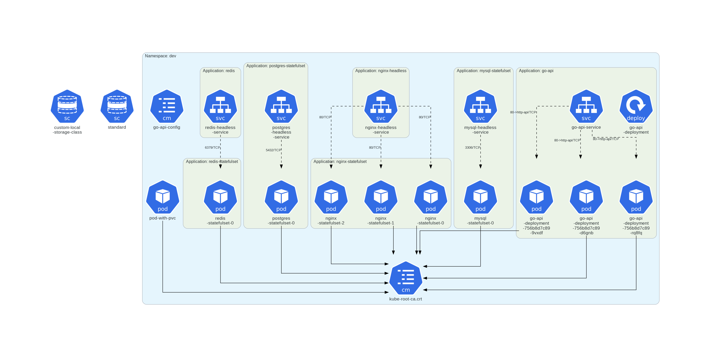

# Full Stack K8S Lab 

### Dev Namespace

(Open image in new tab for a clearer view)

### Staging Namespace

(Open image in new tab for a clearer view)

### Observability Namespace

(Open image in new tab for a clearer view)

### Ingress-nginx Namespace

(Open image in new tab for a clearer view)

## Where to start?
If you're looking to understand the structure and maintenance of this lab, your first stop should be the `Lab` directory. It contains all the manifests for the lab.

For insights into my thought process during development, you can refer to the `CHANGELOG.md`, `openSource_Tools_used.md` and `Problems-and-solution-faced.md` files located in the root directory.

## Workloads
These are the workloads that are currently in the Lab. For more information about upcoming workloads you can check `CHANGELOG.md`

- Go (backend)
- Nginx (k8s hosted)
- Postgres db (k8s hosted)
- Mysql db (k8s hosted)
- Redis (k8s hosted)